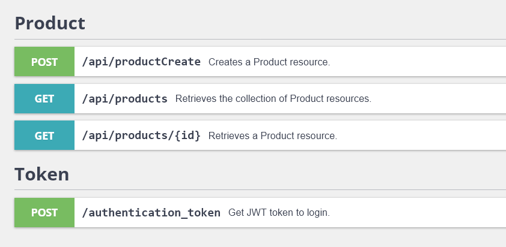

# Ecommerce-product-api
## Prueba Tecnica Backend
Querido developer,

Antes de nada, agradecerte el tiempo invertido en la realización de esta prueba técnica. El objetivo de la prueba es analizar tu capacidad de resolución de problemas, la estructura de tu código y tu experiencia con Symfony.

Enunciado: Imaginemos un escenario en el que tenemos un e-commerce y debemos desarrollar una API REST para obtener los productos que serviremos a una app móvil. 

El producto, se compone de campos básicos, nombre, una descripción, el precio y el tipo de IVA, (4%, 10% y 21%).

Para ello, es necesario contar con los siguientes endpoint:

- Listado de productos. Este endpoint debe incluir un filtro por nombre del producto. Además, debe de tener paginación de los resultados del listado.
- Creación de producto: Este endpoint debe permitir añadir productos a la base de datos a usuarios autenticados. El API reconocerá una petición autenticada como una que incluya la cabecera 'Authorization' con valor 'Bearer admintoken'. La particularidad de este endpoint es que el precio enviado en el endpoint es sin impuestos, y debe calcularse y almacenarse el precio con el impuesto aplicado y sin él.

### TO DO:

- Arquitectura de aplicación en Symfony. Justificar la decisión.
- Construir el modelo de datos con todas las entidades y relaciones. Se pueden usar ORM's
- Endpoints para recuperar y crear los productos
- Testing necesario para validar que la funcionalidad es correcta, se valorará usar testing automatizado como por ejemplo Jest.

### Puntos a tener en cuenta:

- Diseño del modelo de datos
- API REST
- Arquitectura de aplicación en Organización y tipos de tests implementados

Se valorará el uso de cualquier módulo que pueda ayudar a resolver el problema, la simplicidad de la resolución y la organización y la estructura del código.

Para realizar la entrega, subir la prueba a cualquier repositorio (Github, Gitlab, Bitbucket) y compartirnos el enlace

---

## Resultado

Para comenzar los comandos de ejecución:

    $ composer install
    $ symfony server:start -d
    $ docker-compose up -d
 
Interface del <a href="/api">api</a>

